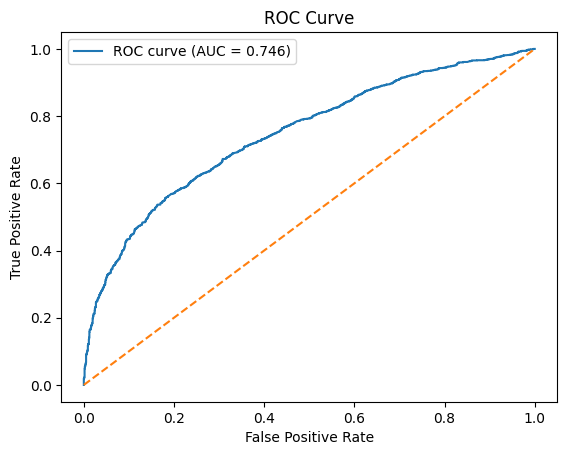

# 📊 Bank Deposit Prediction

## Описание проекта

Цель проекта — разработать модель машинного обучения для прогнозирования того, откроет ли клиент банковский депозит на основе данных маркетинговой кампании.

Такие модели позволяют банкам:

* повышать эффективность маркетинговых кампаний
* сокращать количество нерезультативных звонков
* фокусироваться на клиентах с наибольшей вероятностью отклика

Проект демонстрирует полный цикл работы Data Scientist: от анализа данных до обучения и сравнения моделей.

---

## Данные

Данные о клиентах банка:

* age (возраст);
* job (сфера занятости);
* marital (семейное положение);
* education (уровень образования);
* default (имеется ли просроченный кредит);
* housing (имеется ли кредит на жильё);
* loan (имеется ли кредит на личные нужды);
* balance (баланс).

Данные, связанные с последним контактом в контексте текущей маркетинговой кампании:

* contact (тип контакта с клиентом);
* month (месяц, в котором был последний контакт);
* day (день, в который был последний контакт);
* duration (продолжительность контакта в секундах).

Прочие признаки:

* campaign (количество контактов с этим клиентом в течение текущей кампании);
* pdays (количество пропущенных дней с момента последней маркетинговой кампании до контакта в текущей кампании);
* previous (количество контактов до текущей кампании)
* poutcome (результат прошлой маркетинговой кампании).

Целевая переменная:

**deposit**

* 1 — клиент открыл депозит
* 0 — клиент отказался

Размер датасета: ~40 000 наблюдений.

---

## Используемые технологии

* Python
* pandas
* NumPy
* matplotlib
* seaborn
* scikit-learn
* CatBoost

---

## Этапы проекта

### 1. Знакомство с данными

* Выполнено первичное знакомство с данными
* Обработаны пропуски
* Обработаны пропуски

### 2. Разведочный анализ данных (EDA)

Проведен анализ структуры данных:

* исследованы распределения признаков
* выявлены зависимости между признаками и целевой переменной
* проанализированы корреляции

---

### 3. Подготовка данных

Был реализован preprocessing pipeline с использованием ColumnTransformer:

* One-Hot Encoding категориальных признаков
* масштабирование числовых признаков
* обработка бинарных признаков

Данные были разделены на обучающую и тестовую выборки.

---

### 4. Обучение моделей

Для решения задачи были обучены несколько моделей машинного обучения:

* Logistic Regression
* Random Forest
* Gradient Boosting
* CatBoost
* Stacking

Для модели CatBoost был выполнен подбор гиперпараметров с использованием Optuna.

---

### 5. Оценка моделей

Модели оценивались с использованием следующих метрик:

* Accuracy
* Precision
* F1-score
* ROC-AUC

Основной метрикой сравнения моделей была выбрана **ROC-AUC**, так как она позволяет оценить способность модели различать классы при различных значениях порога классификации.

---

## Результаты моделей

| Модель                | Accuracy  | Precision | F1-score  | ROC-AUC   |
| --------------------- | --------- | --------- | --------- | --------- |
| Random Forest         | 0.692     | 0.712     | 0.630     | 0.746     |
| Stacking              | 0.688     | 0.694     | 0.633     | 0.746     |
| CatBoost (baseline)   | 0.688     | 0.703     | 0.627     | 0.744     |
| Gradient Boosting     | 0.689     | 0.704     | 0.627     | 0.742     |
| Random Forest (tuned) | 0.691     | 0.706     | 0.632     | 0.740     |
| **CatBoost (tuned)**  | **0.696** | **0.717** | **0.634** | **0.746** |

Несколько моделей показали одинаковое значение ROC-AUC, поэтому дополнительно были проанализированы метрики Accuracy, Precision и F1-score.

Лучший результат показала модель **CatBoost с подобранными гиперпараметрами**, которая продемонстрировала лучшие значения Accuracy, Precision и F1-score.

---

## ROC-кривая лучшей модели

---

## Выводы

В рамках проекта была построена модель машинного обучения для прогнозирования отклика клиентов на маркетинговую кампанию банка.

Лучший результат показала модель CatBoost после подбора гиперпараметров.

Полученная модель способна достаточно хорошо разделять клиентов, которые с высокой вероятностью откроют депозит, что может быть использовано для повышения эффективности маркетинговых кампаний.